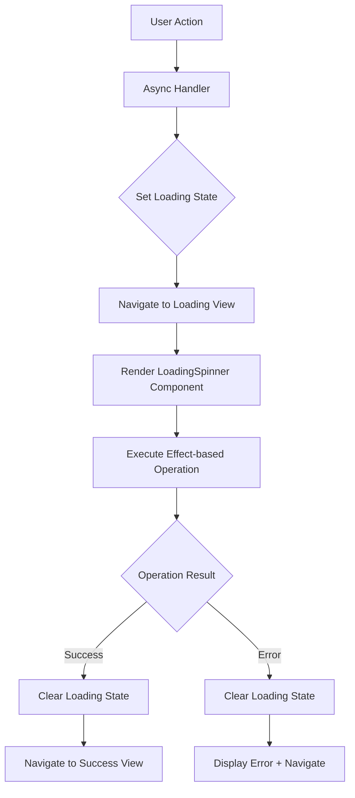
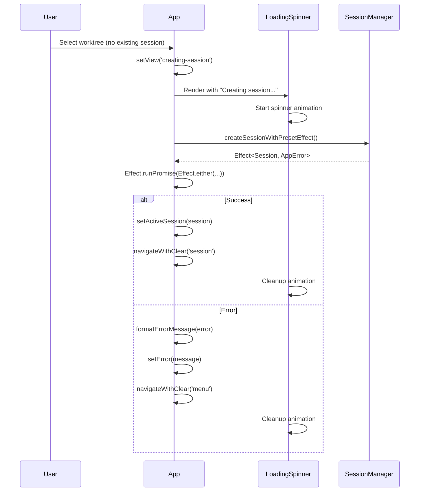
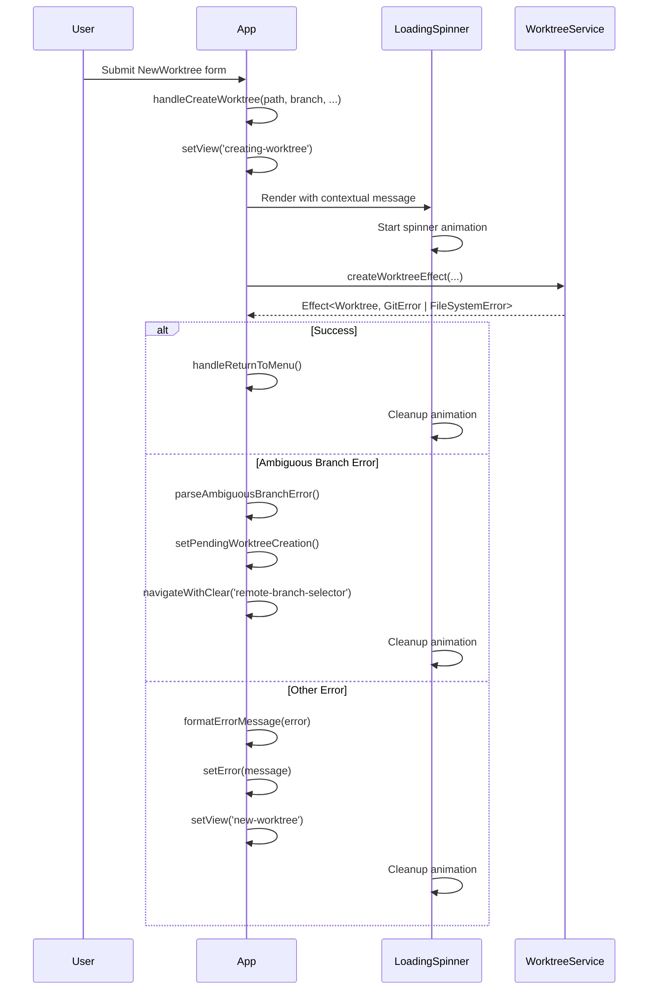
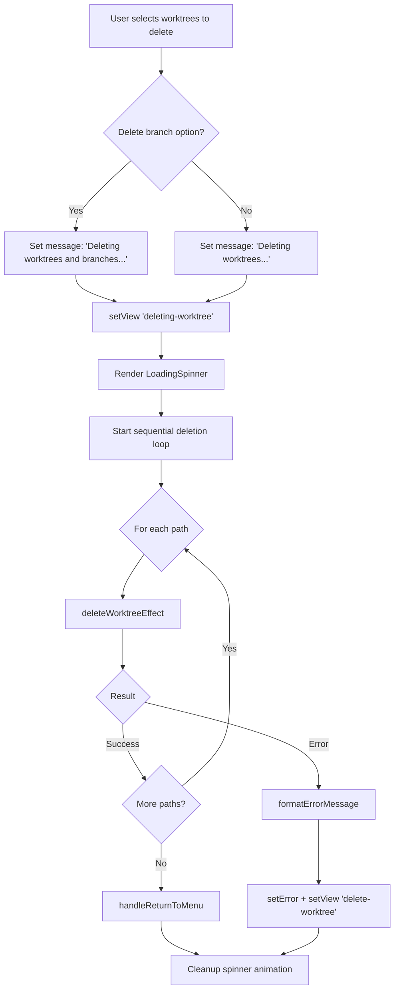
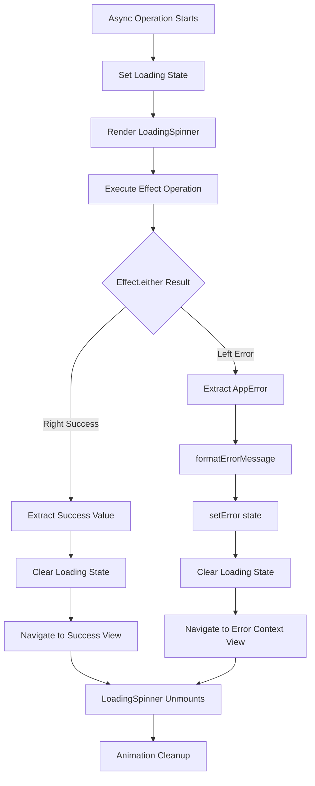
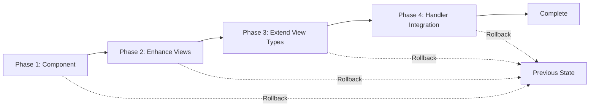

# Technical Design: Loading Spinner for Async Operations

## Overview

This feature enhances the user experience of CCManager by adding visual loading feedback during promise-based asynchronous operations. Currently, users experience uncertainty during long-running operations like session creation, worktree creation, and worktree deletion, as the application provides no visual indication that work is in progress. This design introduces a reusable loading spinner component and integrates it into all async operation flows in the App component.

**Purpose**: This feature delivers immediate visual feedback to users during async operations, eliminating uncertainty about application state and improving the perceived responsiveness of CCManager.

**Users**: Developers using CCManager will see consistent loading indicators when:
- Creating AI assistant sessions (with or without devcontainer initialization)
- Creating new worktrees (with optional session data copying)
- Deleting worktrees (single or batch operations)
- Retrying operations after error resolution

**Impact**: This feature modifies the existing App.tsx component by enhancing existing loading views and adding new loading states for session creation. The changes are additive and maintain backward compatibility with the existing view-based navigation pattern.

### Goals

- Provide immediate visual feedback for all promise-based async operations in App.tsx
- Eliminate user uncertainty during long-running operations (2+ seconds)
- Maintain consistency with CCManager's existing Ink-based UI patterns
- Ensure proper state management and cleanup in both success and error paths
- Support cross-terminal compatibility with Unicode and ASCII fallback

### Non-Goals

- Loading indicators for synchronous operations or operations under 1 second
- Loading states for components outside of App.tsx (Menu, Session, etc.)
- Progress bars showing percentage completion
- Cancellable async operations (operations must complete once started)
- Loading state persistence across application restarts

## Architecture

### Existing Architecture Analysis

CCManager follows a view-based navigation pattern in App.tsx where the `view` state determines which component is rendered. Existing loading states include:
- `'creating-worktree'`: Static text "Creating worktree..."
- `'deleting-worktree'`: Static text "Deleting worktrees..."
- `'clearing'`: Null render for screen clearing

The application uses:
- **React/Ink**: Functional components with hooks for terminal UI
- **Effect-ts**: Type-safe error handling with tagged errors (AppError union)
- **View-based routing**: Single state variable controls entire application flow
- **Async handlers**: Promise-based event handlers (handleSelectWorktree, handleCreateWorktree, etc.)

Existing patterns to preserve:
- View union type for all application states
- navigateWithClear() helper for view transitions
- formatErrorMessage() for AppError discrimination
- Effect.runPromise + Effect.either for async operations

### High-Level Architecture



The architecture integrates the new LoadingSpinner component into existing async operation flows:

1. **User triggers async operation** (select worktree, create worktree, delete worktree)
2. **Handler sets loading state** (new view state or existing loading view enhancement)
3. **LoadingSpinner renders** with operation-specific message
4. **Effect executes** (Effect.runPromise of service method)
5. **State cleanup happens** in both success and error branches
6. **Navigation occurs** to appropriate next view

### Technology Alignment

This feature extends CCManager's existing technology stack without introducing new dependencies:

**UI Layer**:
- **Ink** (existing ^4.1.0): Box, Text components for loading UI
- **React** (existing ^18.2.0): useState, useEffect, useCallback hooks
- **Custom animation**: Time-based character rotation for spinner (no external spinner library needed)

**State Management**:
- **View-based navigation**: Extends existing View union type
- **React hooks**: Component-local state for spinner animation frame

**Error Handling**:
- **Effect-ts** (existing ^3.18.2): Maintains Effect.runPromise + Effect.either pattern
- **Tagged errors**: Uses existing formatErrorMessage and AppError union

**Testing**:
- **Vitest** (existing ^3.2.2): Unit tests for LoadingSpinner component
- **ink-testing-library** (existing ^3.0.0): Component rendering verification

No new libraries required. The design uses built-in Ink components and React hooks for spinner animation, avoiding the need for ink-spinner dependency.

### Key Design Decisions

#### Decision 1: Custom Spinner Animation vs. External Library

**Context**: Requirements specify using "Ink Spinner component from ink package if available, otherwise use custom animated text solution". Investigation revealed that ink-spinner is a separate package not currently in dependencies.

**Alternatives**:
1. **Add ink-spinner dependency**: Install and use external spinner library
2. **Custom React implementation**: Build spinner with useEffect and rotating characters
3. **Static loading text**: No animation, just text messages

**Selected Approach**: Custom React implementation using useEffect-based animation with Unicode/ASCII character rotation.

Implementation:
- useEffect hook with setInterval for frame updates (120ms interval)
- Unicode spinner frames: `⠋ ⠙ ⠹ ⠸ ⠼ ⠴ ⠦ ⠧ ⠇ ⠏`
- ASCII fallback frames: `- \\ | /`
- State cleanup on component unmount to prevent memory leaks

**Rationale**:
- Avoids adding external dependency for simple animation
- Full control over frame rate and animation behavior
- Easier to maintain and test within existing codebase
- Aligns with CCManager's minimal dependency philosophy
- Terminal compatibility handled explicitly in component

**Trade-offs**:
- **Gain**: No external dependency, full customization, simpler maintenance
- **Sacrifice**: Need to implement our own animation logic and terminal detection
- **Risk**: Slight increase in code complexity, but manageable with proper component isolation

#### Decision 2: View-Based Loading States vs. Boolean Flags

**Context**: CCManager uses view-based navigation where a single `view` state variable determines rendered component. Loading feedback must integrate with this pattern while maintaining clean state management.

**Alternatives**:
1. **Add isLoading boolean flags**: Separate loading state alongside view state
2. **Extend View union**: Add specific loading view states for each operation
3. **Enhance existing views**: Add spinner to existing 'creating-worktree' and 'deleting-worktree' views

**Selected Approach**: Hybrid approach combining View extension and view enhancement.

Implementation:
- **New view states**: `'creating-session'` and `'creating-session-preset'` for session loading
- **Enhanced existing views**: Add LoadingSpinner to `'creating-worktree'` and `'deleting-worktree'` views
- **No additional boolean flags**: Single source of truth remains the view state

**Rationale**:
- Maintains consistency with existing architecture pattern
- Prevents state synchronization issues between view and isLoading flags
- Makes loading state explicit and discoverable in View type union
- Simplifies component rendering logic (single switch on view state)
- Natural fit with navigateWithClear() helper function

**Trade-offs**:
- **Gain**: Consistent architecture, single source of truth, explicit state modeling
- **Sacrifice**: Slight increase in View union size (2 new states)
- **Benefit**: View-based routing makes state transitions clear and testable

#### Decision 3: Message Customization Strategy

**Context**: Different async operations require different loading messages (e.g., "Creating session..." vs. "Starting devcontainer and creating session..."). The design must support operation-specific messaging without code duplication.

**Alternatives**:
1. **Hardcoded messages in views**: Each loading view has fixed message
2. **Message prop on LoadingSpinner**: Component accepts dynamic message string
3. **Message composition in handlers**: Handlers build message string based on operation context

**Selected Approach**: Message composition in handlers with LoadingSpinner accepting message prop.

Implementation:
- **LoadingSpinner component**: Accepts `message: string` prop
- **Handler-level composition**: Handlers determine message based on operation context
  - `handleSelectWorktree`: Checks devcontainerConfig to determine message
  - `handleCreateWorktree`: Checks copySessionData/copyClaudeDirectory flags
  - `handleDeleteWorktrees`: Checks deleteBranch flag
- **View rendering**: Each loading view passes specific message to LoadingSpinner

Example:
```typescript
// In handleSelectWorktree
const message = devcontainerConfig
  ? "Starting devcontainer and creating session..."
  : "Creating session...";
setView('creating-session');
// LoadingSpinner renders with appropriate message
```

**Rationale**:
- Maximum flexibility for operation-specific messaging
- Clear separation: component renders spinner, caller determines context
- Easy to extend with new operation types or message variations
- Testable: can verify correct messages for different operation contexts

**Trade-offs**:
- **Gain**: Flexible messaging, clear responsibilities, easy to extend
- **Sacrifice**: Handlers must manage message logic, slight increase in handler complexity
- **Mitigation**: Message logic is simple conditionals, well-documented in code

## System Flows

### Session Creation Flow



### Worktree Creation Flow



### Worktree Deletion Flow



## Requirements Traceability

| Requirement | Components | Interfaces | Flows |
|-------------|------------|------------|-------|
| 1.1-1.7 (Session Creation) | LoadingSpinner, App | View state: 'creating-session', 'creating-session-preset' | Session Creation Flow |
| 2.1-2.7 (Worktree Creation) | LoadingSpinner, App (existing 'creating-worktree' view) | Enhanced existing view rendering | Worktree Creation Flow |
| 3.1-3.6 (Worktree Deletion) | LoadingSpinner, App (existing 'deleting-worktree' view) | Enhanced existing view rendering | Worktree Deletion Flow |
| 4.1-4.6 (Consistent Component) | LoadingSpinner component | Props: message, spinnerType?, color? | All flows use same component |
| 5.1-5.6 (State Management) | App component | View-based state transitions | All flows handle cleanup |
| 6.1-6.5 (Backwards Compatibility) | App view rendering | View union extension | Existing flows preserved |
| 7.1-7.6 (Error Handling) | App formatErrorMessage | Effect.either pattern | Error branches in all flows |
| 8.1-8.6 (Accessibility) | LoadingSpinner animation | Unicode/ASCII detection | Terminal compatibility built-in |
| 9.1-9.6 (Testing) | LoadingSpinner.test.tsx, App.test.tsx | Unit + integration tests | Test suites verify all scenarios |

## Components and Interfaces

### UI Components Layer

#### LoadingSpinner Component

**Responsibility & Boundaries**
- **Primary Responsibility**: Render animated loading indicator with descriptive message for async operations
- **Domain Boundary**: Pure UI presentation component with no business logic or external dependencies
- **Data Ownership**: Owns animation frame state (current spinner character index)
- **Transaction Boundary**: None (stateless presentation component, only local animation state)

**Dependencies**
- **Inbound**: App component renders LoadingSpinner during async operations
- **Outbound**: Ink Box and Text components for terminal rendering
- **External**: React hooks (useState, useEffect) for animation lifecycle

**Contract Definition**

**Component Interface**:
```typescript
interface LoadingSpinnerProps {
  message: string;                           // Descriptive text for operation
  spinnerType?: 'dots' | 'line';            // Animation style (default: 'dots')
  color?: 'cyan' | 'yellow' | 'green';      // Spinner color (default: 'cyan')
}

const LoadingSpinner: React.FC<LoadingSpinnerProps>;
```

**Behavior Contract**:
- **Preconditions**: None (accepts any valid string message)
- **Postconditions**:
  - Renders animated spinner with message in Box layout
  - Cleans up animation interval on component unmount
  - Animation frame updates every 120ms
- **Invariants**:
  - Spinner animation always active while component is mounted
  - Message text remains static after initial render
  - Color remains consistent throughout animation

**Animation Frames**:
```typescript
// Unicode frames (default)
const unicodeFrames = ['⠋', '⠙', '⠹', '⠸', '⠼', '⠴', '⠦', '⠧', '⠇', '⠏'];

// ASCII fallback (detected via terminal capability)
const asciiFrames = ['-', '\\', '|', '/'];
```

**Layout Structure**:
```typescript
<Box flexDirection="row">
  <Text color={color}>{currentFrame} </Text>
  <Text>{message}</Text>
</Box>
```

**State Management**:
- **State Model**:
  - `frameIndex: number` - Current position in frames array (0 to frames.length-1)
  - Cycles through frames using modulo arithmetic
- **Persistence**: None (ephemeral animation state)
- **Concurrency**: Single component instance, no concurrent animation conflicts

#### App Component - Enhanced Views

**Responsibility & Boundaries**
- **Primary Responsibility**: Orchestrate view navigation and integrate LoadingSpinner into async operation flows
- **Domain Boundary**: Application-level routing and async operation coordination
- **Data Ownership**: View state, session state, worktree service instances, loading operation context
- **Transaction Boundary**: Single async operation per view state (no concurrent operations)

**Dependencies**
- **Inbound**: User interactions from Menu, forms (NewWorktree, DeleteWorktree), and selectors
- **Outbound**:
  - LoadingSpinner for loading UI
  - SessionManager for session operations (via createSessionWithEffect)
  - WorktreeService for worktree operations (via Effect-based methods)
- **External**:
  - Effect-ts for error handling
  - Ink for terminal rendering
  - React hooks for state and lifecycle management

**Contract Definition**

**View State Extension**:
```typescript
type View =
  | 'menu'
  | 'project-list'
  | 'session'
  | 'new-worktree'
  | 'creating-worktree'          // Enhanced with LoadingSpinner
  | 'creating-session'            // NEW: Session creation loading
  | 'creating-session-preset'     // NEW: Preset selection loading
  | 'delete-worktree'
  | 'deleting-worktree'           // Enhanced with LoadingSpinner
  | 'merge-worktree'
  | 'configuration'
  | 'preset-selector'
  | 'remote-branch-selector'
  | 'clearing';
```

**Enhanced View Rendering**:
```typescript
// Creating worktree view (enhanced)
if (view === 'creating-worktree') {
  const message = copySessionData
    ? "Creating worktree and copying session data..."
    : "Creating worktree...";

  return (
    <Box flexDirection="column">
      <LoadingSpinner message={message} color="cyan" />
    </Box>
  );
}

// Creating session view (new)
if (view === 'creating-session') {
  const message = devcontainerConfig
    ? "Starting devcontainer and creating session..."
    : "Creating session...";

  return (
    <Box flexDirection="column">
      <LoadingSpinner message={message} color="yellow" />
    </Box>
  );
}

// Deleting worktrees view (enhanced)
if (view === 'deleting-worktree') {
  const message = deleteBranch
    ? "Deleting worktrees and branches..."
    : "Deleting worktrees...";

  return (
    <Box flexDirection="column">
      <LoadingSpinner message={message} color="cyan" />
    </Box>
  );
}
```

**Async Handler Modifications**:
```typescript
// handleSelectWorktree - Session creation path
const handleSelectWorktree = async (worktree: Worktree) => {
  // ... special worktree handling (new, delete, config, exit)

  let session = sessionManager.getSession(worktree.path);

  if (!session) {
    if (configurationManager.getSelectPresetOnStart()) {
      setSelectedWorktree(worktree);
      navigateWithClear('preset-selector');
      return;
    }

    // NEW: Set loading state before async operation
    setView('creating-session');

    const result = await createSessionWithEffect(worktree.path);

    if (!result.success) {
      setError(result.errorMessage!);
      navigateWithClear('menu');  // Error clears loading state
      return;
    }

    session = result.session!;
  }

  setActiveSession(session);
  navigateWithClear('session');  // Success clears loading state
};

// handlePresetSelected - Preset session creation
const handlePresetSelected = async (presetId: string) => {
  if (!selectedWorktree) return;

  // NEW: Set loading state before async operation
  setView('creating-session-preset');

  const result = await createSessionWithEffect(
    selectedWorktree.path,
    presetId,
  );

  if (!result.success) {
    setError(result.errorMessage!);
    setView('menu');  // Error clears loading state
    setSelectedWorktree(null);
    return;
  }

  setActiveSession(result.session!);
  navigateWithClear('session');  // Success clears loading state
  setSelectedWorktree(null);
};
```

**State Management**:
- **State Model**:
  - View state transitions govern loading visibility
  - No separate isLoading flags (single source of truth)
  - Transitions: non-loading → loading → (success/error view)
- **Persistence**: None (ephemeral loading state per operation)
- **Concurrency**: Single async operation enforced by view state (new operation requires view transition)

**Integration Strategy**:
- **Modification Approach**: Extend existing App.tsx component
  - Add new view states to View union type
  - Enhance existing loading view renders with LoadingSpinner
  - Modify async handlers to set loading states before operations
  - Maintain existing error handling and navigation patterns
- **Backward Compatibility**:
  - Existing views unchanged in behavior
  - Loading views add spinner but preserve text and colors
  - navigateWithClear() continues to work identically
  - formatErrorMessage() unchanged
- **Migration Path**:
  - Phase 1: Add LoadingSpinner component
  - Phase 2: Enhance existing loading views
  - Phase 3: Add new session loading views
  - Phase 4: Update handlers to use loading states
  - No breaking changes, incremental enhancement

## Error Handling

### Error Strategy

CCManager uses Effect-ts for type-safe error handling with tagged errors (AppError union). The loading spinner feature maintains this pattern while ensuring proper state cleanup in error scenarios.

**Core Principles**:
1. **Loading state cleanup happens in both success and error paths**
2. **Effect.either provides explicit success/error discrimination**
3. **formatErrorMessage converts tagged errors to user-friendly strings**
4. **View navigation automatically cleans up loading state (component unmounts)**

### Error Categories and Responses

**User Errors (Validation)**:
- **Scenario**: Invalid input to worktree creation (bad path, invalid branch name)
- **Error Type**: ValidationError
- **Response**:
  - Clear loading state immediately
  - Display error above form (preserved in error state)
  - Return to form view (new-worktree) with error context
  - User can correct input and retry

**System Errors (Infrastructure)**:
- **Scenario**: Git command failure (e.g., worktree add fails with non-zero exit)
- **Error Type**: GitError with command, exitCode, stderr
- **Response**:
  - Clear loading state immediately
  - Format error with command details and stderr output
  - Navigate to appropriate view (menu or form) with error displayed
  - For ambiguous branch errors, redirect to disambiguation flow

- **Scenario**: File system operation failure (e.g., cannot create directory)
- **Error Type**: FileSystemError with operation, path, cause
- **Response**:
  - Clear loading state immediately
  - Display filesystem-specific error message
  - Navigate to menu or form view with error context
  - User can investigate and retry

- **Scenario**: PTY process spawn failure during session creation
- **Error Type**: ProcessError with command, signal, exitCode
- **Response**:
  - Clear loading state immediately
  - Display process-specific error details
  - Navigate to menu view
  - User can check system state and retry

**Business Logic Errors (Operation Conflicts)**:
- **Scenario**: Session already exists for worktree
- **Error Type**: Not an error - handled as no-op (getSession returns existing)
- **Response**: Skip session creation, proceed to session view directly

- **Scenario**: Worktree already exists at path
- **Error Type**: GitError with exit code 128
- **Response**:
  - Clear loading state immediately
  - Display error indicating path conflict
  - Return to new-worktree form with error
  - User can choose different path

### Error Flow Diagram



**Key Error Handling Points**:

1. **Effect.either ensures explicit error handling**:
```typescript
const result = await Effect.runPromise(
  Effect.either(worktreeService.createWorktreeEffect(...))
);

if (result._tag === 'Left') {
  // Error path - guaranteed to handle
  const errorMessage = formatErrorMessage(result.left);
  setError(errorMessage);
  setView('new-worktree');  // Clears loading state
} else {
  // Success path
  handleReturnToMenu();  // Clears loading state
}
```

2. **View navigation automatically cleans up loading component**:
- When view changes (setView or navigateWithClear), React unmounts current component
- LoadingSpinner useEffect cleanup runs, clearing animation interval
- No manual cleanup needed in handlers

3. **Error state preservation for user context**:
- setError(message) stores error string in App state
- Form views display error above input fields
- User sees what went wrong before retrying operation

### Monitoring

**Error Tracking**:
- Effect-ts automatically propagates errors through Effect chain
- All errors reach formatErrorMessage for consistent logging format
- Error messages include operation context (command, path, etc.)

**Logging Strategy**:
- Console output for development (Effect.runPromise failures log to console)
- Error state captured in React state for UI display
- No persistent logging in this feature (future enhancement)

**Health Monitoring**:
- Loading state timeout detection (potential future enhancement)
- If operation exceeds expected duration (e.g., >30s), could show warning
- Current design: operations complete naturally or fail with error

## Testing Strategy

### Unit Tests

**LoadingSpinner Component**:
1. **Render with default props**: Verify component renders message with cyan spinner
2. **Render with custom color**: Verify yellow color applied for devcontainer operations
3. **Animation frame updates**: Verify useEffect interval updates frameIndex every 120ms
4. **Cleanup on unmount**: Verify clearInterval called when component unmounts
5. **Message text preserved**: Verify message prop renders correctly and doesn't change during animation

**App Component - Loading State Logic**:
1. **handleSelectWorktree loading state**: Verify setView('creating-session') called before createSessionWithEffect
2. **handlePresetSelected loading state**: Verify setView('creating-session-preset') called before async operation
3. **handleCreateWorktree existing behavior**: Verify setView('creating-worktree') still called (existing test)
4. **handleDeleteWorktrees existing behavior**: Verify setView('deleting-worktree') still called (existing test)

### Integration Tests

**Session Creation Flow**:
1. **Select worktree without session**:
   - Verify loading view renders with LoadingSpinner
   - Mock Effect.runPromise to return success
   - Verify navigation to session view
   - Verify loading state cleared

2. **Select worktree with session creation error**:
   - Verify loading view renders
   - Mock Effect.runPromise to return Left(ProcessError)
   - Verify formatErrorMessage called
   - Verify error displayed and navigation to menu
   - Verify loading state cleared

3. **Preset selection with devcontainer**:
   - Verify loading view renders with "Starting devcontainer..." message
   - Mock Effect.runPromise to simulate devcontainer flow
   - Verify appropriate loading duration feedback

**Worktree Creation Flow**:
1. **Create worktree without session data**:
   - Verify loading view renders with "Creating worktree..." message
   - Mock createWorktreeEffect to return success
   - Verify navigation to menu
   - Verify loading state cleared

2. **Create worktree with session data copy**:
   - Verify loading view renders with "Creating worktree and copying session data..." message
   - Mock createWorktreeEffect with copySessionData=true
   - Verify appropriate message displayed

3. **Create worktree with ambiguous branch error**:
   - Verify loading view renders
   - Mock createWorktreeEffect to return Left(GitError with ambiguous pattern)
   - Verify parseAmbiguousBranchError called
   - Verify navigation to remote-branch-selector
   - Verify loading state cleared

**Worktree Deletion Flow**:
1. **Delete single worktree without branch**:
   - Verify loading view renders with "Deleting worktrees..." message
   - Mock deleteWorktreeEffect to return success
   - Verify navigation to menu
   - Verify loading state cleared

2. **Delete multiple worktrees with branch deletion**:
   - Verify loading view renders with "Deleting worktrees and branches..." message
   - Mock sequential deleteWorktreeEffect calls
   - Verify loading persists across loop iterations
   - Verify navigation to menu after all deletions

3. **Delete worktree with error on second deletion**:
   - Mock first deleteWorktreeEffect to return success
   - Mock second deleteWorktreeEffect to return Left(GitError)
   - Verify loading state cleared
   - Verify error displayed and navigation to delete-worktree view

### E2E/UI Tests (ink-testing-library)

1. **LoadingSpinner renders in terminal**:
   - Use render() from ink-testing-library
   - Verify findByText locates message text
   - Verify spinner character visible in output

2. **Loading state during async operation**:
   - Render App component with mocked services
   - Trigger worktree selection
   - Verify lastFrame() contains spinner character
   - Verify message text appears in output

3. **Loading state clears on success**:
   - Render App component
   - Trigger async operation
   - Wait for Effect completion
   - Verify spinner no longer in lastFrame()
   - Verify navigation to success view

4. **Loading state clears on error**:
   - Render App component with failing mock
   - Trigger async operation
   - Wait for Effect failure
   - Verify error message in lastFrame()
   - Verify spinner no longer present

### Performance Tests

1. **Animation frame rate**: Verify updates occur every 100-150ms (120ms target)
2. **Memory cleanup**: Verify no memory leaks from setInterval after 100 unmount cycles
3. **Concurrent operations prevention**: Verify second operation cannot start while first is loading (view state enforces)
4. **Error path performance**: Verify error cleanup completes within single render cycle

**Test Coverage Goals**:
- LoadingSpinner component: 100% line and branch coverage
- App loading state logic: All new loading state transitions covered
- Integration tests: All 3 major flows (session, create worktree, delete worktree) with success and error paths
- E2E tests: At least 4 scenarios verifying visual rendering and state cleanup

## Security Considerations

**No security implications**: This feature is purely UI enhancement with no:
- Authentication or authorization changes
- Sensitive data handling (messages are operation descriptions only)
- External API calls or network operations
- User input processing (messages are internally generated)
- Privilege escalation or access control modifications

The feature operates within the existing security boundary of App.tsx component and renders purely cosmetic loading indicators using existing Ink components.

**Potential Concerns Addressed**:
- **No user-controlled message content**: All loading messages are hardcoded or composed from internal flags (devcontainerConfig, copySessionData, etc.)
- **No command injection risks**: Component renders text only, no shell execution
- **No information disclosure**: Error messages use existing formatErrorMessage (no new sensitive data exposed)

## Migration Strategy

This feature requires no migration as it introduces additive changes only:

**Phase 1: Component Creation**
- Add LoadingSpinner component to src/components/
- Add LoadingSpinner.test.tsx with unit tests
- Verify component renders independently

**Phase 2: View Enhancement (Low Risk)**
- Enhance 'creating-worktree' view rendering
- Enhance 'deleting-worktree' view rendering
- Run existing integration tests to ensure no regressions

**Phase 3: View State Extension (Medium Risk)**
- Add 'creating-session' and 'creating-session-preset' to View union
- Add view rendering cases in App.tsx
- Update TypeScript compilation to verify exhaustive View handling

**Phase 4: Handler Integration (Medium Risk)**
- Modify handleSelectWorktree to set loading state
- Modify handlePresetSelected to set loading state
- Update message composition logic for contextual loading messages
- Run full integration test suite

**Rollback Strategy**:
- Each phase can be reverted independently
- No database or file system changes (UI only)
- Git revert of commits restores previous behavior
- No user data affected (stateless loading indicators)

**Validation Checkpoints**:
1. After Phase 1: LoadingSpinner renders correctly in isolation
2. After Phase 2: Existing worktree flows show enhanced loading UI
3. After Phase 3: TypeScript compiles with no View type errors
4. After Phase 4: All integration tests pass, loading states work end-to-end

**Migration Flow**:



**No breaking changes**: All existing functionality preserved, loading indicators added as enhancement.
