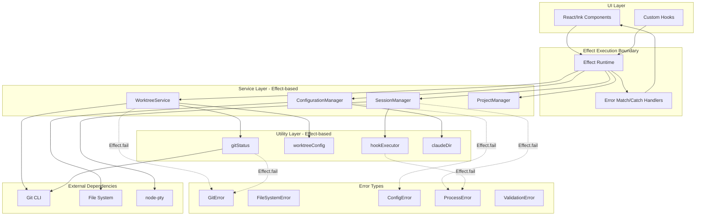
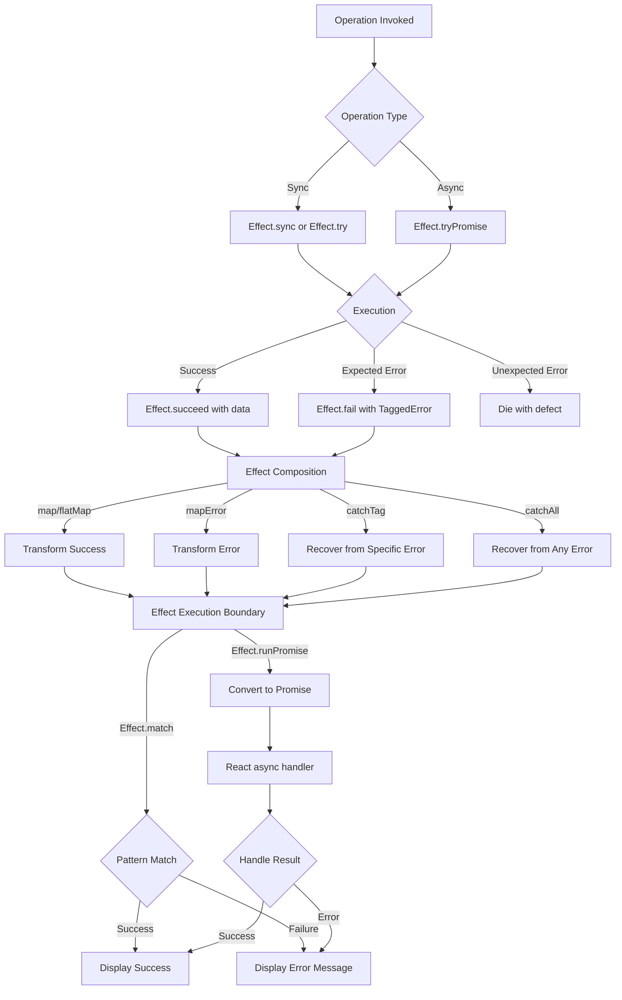
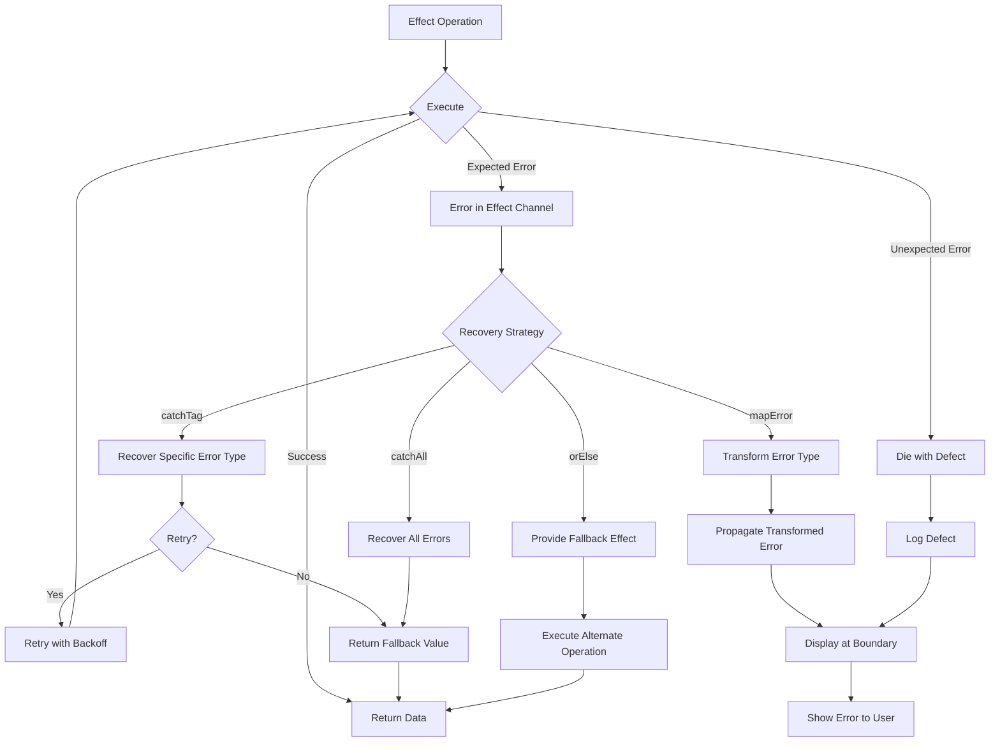

# Technical Design: Effect-ts Error Handling Migration

## Overview

CCManager will migrate from try-catch based error handling to Effect-ts, a production-ready functional programming library that provides type-safe, composable error handling through the Effect type system. This migration addresses current limitations where errors are not type-safe, error handling is inconsistent across the codebase, and it is difficult to distinguish between expected operational failures and unexpected exceptions.

**Purpose**: Establish a type-safe, consistent error handling foundation that makes error flows explicit in the type system, improves code reliability, and enables better error composition and recovery strategies.

**Users**: Developers working on CCManager will benefit from explicit error types, better IDE support, and reduced runtime errors. End users will experience more graceful error handling and clearer error messages.

**Impact**: This change modifies the fundamental error handling approach across all layers (services, utilities, components). The migration will be incremental, maintaining backward compatibility during the transition period, with legacy patterns coexisting alongside Effect-based code until full migration is complete.

### Goals

- Implement type-safe error handling using Effect-ts across services, utilities, and components
- Define structured error types for different failure modes (Git, FileSystem, Config, Process, Validation)
- Establish clear patterns for Effect execution at application boundaries
- Maintain backward compatibility during incremental migration
- Improve error composition, recovery, and debugging capabilities

### Non-Goals

- Implementing Effect's dependency injection system (Context/Layer) in the initial migration
- Migrating to Effect's streaming or scheduling capabilities
- Replacing all existing async code with Effect-based implementations in a single release
- Using Effect Schema for validation (future consideration)

## Architecture

### Existing Architecture Analysis

CCManager follows a service-oriented architecture with clear separation of concerns:

**Current Error Handling Patterns**:
- Services (WorktreeService, SessionManager, ConfigurationManager, ProjectManager) use try-catch with mixed error handling approaches
- Utilities (gitStatus, worktreeConfig, hookExecutor) have inconsistent error handling, some using try-catch, others returning ad-hoc result objects
- The `GitOperationResult<T>` interface in gitStatus.ts provides a basic Result pattern but lacks type safety and composition utilities
- Components handle errors reactively using try-catch in event handlers and useEffect hooks
- 33 try-catch blocks across 10 files identified for migration

**Architecture Constraints to Preserve**:
- React/Ink component-based UI architecture
- Service layer abstraction for business logic
- Utility layer for cross-cutting concerns
- PTY-based session management with node-pty
- Git worktree operations via child_process
- Platform-aware configuration management

**Integration Points to Maintain**:
- React hooks (useEffect, useInput) for UI state and interactions
- EventEmitter pattern in SessionManager for session lifecycle events
- File system operations for configuration persistence
- Child process spawning for Git commands and PTY sessions

### High-Level Architecture



### Technology Alignment

**Existing Technology Stack**:
- TypeScript 5.0.3 with strict type checking ✓ Compatible with Effect-ts requirements
- Node.js >=16 ✓ Supported runtime for Effect-ts
- Vitest for testing ✓ Works with Effect testing utilities
- ESM module system ✓ Effect-ts native ESM support

**New Dependencies**:
- `effect` package (version 3.x) as production dependency
- No additional peer dependencies required

**Alignment with Existing Patterns**:
- Effect types integrate seamlessly with TypeScript's type system
- Effect execution via `Effect.runPromise()` converts to standard Promises for React integration
- Service class methods will return Effect types, maintaining existing class-based service pattern
- Utility functions remain pure, now returning Effect/Either types instead of throwing exceptions

### Key Design Decisions

#### Decision 1: Effect vs Either for Different Operation Types

**Decision**: Use `Effect<A, E>` for asynchronous operations and `Either<E, A>` for synchronous operations.

**Context**: CCManager has both synchronous operations (configuration parsing, path manipulation) and asynchronous operations (Git commands, file I/O, PTY spawning). We need to choose the appropriate type for each use case.

**Alternatives**:
1. Use Effect for all operations (synchronous and asynchronous)
2. Use Either for all operations and convert to Effect when needed
3. Use Either for sync, Effect for async (selected)

**Selected Approach**: Use Either for pure synchronous operations and Effect for asynchronous or potentially side-effectful operations. This provides:
- **Either**: Lightweight type for immediate operations (config validation, path resolution)
- **Effect**: Full effect tracking for async operations with suspension, interruption, and resource management

**Rationale**:
- Either has minimal runtime overhead for synchronous operations
- Effect provides async capabilities (Promise integration, interruption, resource cleanup) needed for I/O operations
- Clear semantic distinction: Either = pure computation result, Effect = effectful operation result
- Effect can compose with Either seamlessly using `Effect.fromEither()`

**Trade-offs**:
- **Gain**: Performance optimization for sync operations, clearer intent in types
- **Sacrifice**: Two types to learn instead of one, conversion needed when mixing sync/async operations

#### Decision 2: Data.TaggedError for All Error Types

**Decision**: All custom error types will extend `Data.TaggedError` from Effect.

**Context**: We need structured error types with good discrimination for type narrowing, serialization support, and stack trace capture.

**Alternatives**:
1. Use plain TypeScript classes with Error inheritance
2. Use Data.TaggedClass for errors
3. Use Data.TaggedError (selected)

**Selected Approach**: Define errors as classes extending `Data.TaggedError`:
```typescript
class GitError extends Data.TaggedError("GitError")<{
  command: string;
  exitCode: number;
  stderr: string;
}> {}
```

**Rationale**:
- Automatic `_tag` property for discriminated unions
- Built-in stack trace capture
- Serialization support for logging/debugging
- Pattern matching support with `Effect.catchTag()`
- Extends Error for compatibility with standard JavaScript error handling

**Trade-offs**:
- **Gain**: Type-safe error discrimination, better debugging, automatic serialization
- **Sacrifice**: Requires Effect-ts runtime dependency for error creation

#### Decision 3: Incremental Migration with Adapter Layer

**Decision**: Implement adapter functions to bridge legacy `GitOperationResult<T>` and new Effect types during migration.

**Context**: The codebase has 33 try-catch blocks across 10 files. Migrating all at once would create a large, risky changeset. We need an incremental approach.

**Alternatives**:
1. Big bang migration - convert everything at once
2. Parallel implementations - maintain both old and new APIs indefinitely
3. Incremental with adapters - temporary compatibility layer (selected)

**Selected Approach**: Create adapter utilities in a new `src/utils/effectAdapters.ts`:
```typescript
// Convert legacy GitOperationResult to Either
function resultToEither<T, E>(result: GitOperationResult<T>): Either<string, T>

// Convert Either to legacy GitOperationResult for backward compatibility
function eitherToResult<T>(either: Either<string, T>): GitOperationResult<T>
```

**Rationale**:
- Allows testing and validating Effect integration module-by-module
- Maintains application stability during migration
- Enables gradual rollout with smaller, reviewable pull requests
- Provides escape hatch if issues arise
- Adapters can be removed once migration is complete

**Trade-offs**:
- **Gain**: Reduced migration risk, ability to validate each step, smaller changesets
- **Sacrifice**: Temporary maintenance burden of dual patterns, adapter code to remove later

## System Flows

### Error Flow Architecture



### Migration Flow Process

```mermaid
graph TB
    Start[Start Migration] --> Phase1{Phase 1: Foundation}

    Phase1 --> InstallDep[Install effect package]
    InstallDep --> DefineErrors[Define Error Types]
    DefineErrors --> CreateAdapters[Create Adapter Utilities]
    CreateAdapters --> DocPatterns[Document Usage Patterns]

    DocPatterns --> Phase2{Phase 2: Utilities}

    Phase2 --> MigUtil1[Migrate gitStatus.ts]
    MigUtil1 --> TestUtil1[Test gitStatus]
    TestUtil1 --> MigUtil2[Migrate worktreeConfig.ts]
    MigUtil2 --> TestUtil2[Test worktreeConfig]
    TestUtil2 --> MigUtil3[Migrate hookExecutor.ts]
    MigUtil3 --> TestUtil3[Test hookExecutor]
    TestUtil3 --> MigUtil4[Migrate claudeDir.ts]
    MigUtil4 --> TestUtil4[Test claudeDir]

    TestUtil4 --> Phase3{Phase 3: Services}

    Phase3 --> MigSvc1[Migrate WorktreeService]
    MigSvc1 --> TestSvc1[Test WorktreeService]
    TestSvc1 --> MigSvc2[Migrate ConfigurationManager]
    MigSvc2 --> TestSvc2[Test ConfigurationManager]
    TestSvc2 --> MigSvc3[Migrate SessionManager]
    MigSvc3 --> TestSvc3[Test SessionManager]
    TestSvc3 --> MigSvc4[Migrate ProjectManager]
    MigSvc4 --> TestSvc4[Test ProjectManager]

    TestSvc4 --> Phase4{Phase 4: Components}

    Phase4 --> MigComp[Update Component Error Handling]
    MigComp --> TestComp[Test Components]
    TestComp --> UpdateHooks[Update Custom Hooks]
    UpdateHooks --> TestHooks[Test Hooks]

    TestHooks --> Phase5{Phase 5: Cleanup}

    Phase5 --> RemoveAdapters[Remove Adapter Functions]
    RemoveAdapters --> RemoveLegacy[Remove GitOperationResult]
    RemoveLegacy --> FinalTest[Full Test Suite]
    FinalTest --> Complete[Migration Complete]
```



## Requirements Traceability

| Requirement | Summary | Components | Interfaces | Flows |
|-------------|---------|------------|------------|-------|
| 1.1-1.5 | Effect-ts Integration | package.json, tsconfig.json | effect package dependency | N/A |
| 2.1-2.6 | Core Effect Types | All services, utilities | Effect<A,E,never>, Either<E,A> | Error Flow Architecture |
| 3.1-3.9 | Effect Constructors | effectAdapters.ts, all migrated modules | Effect.succeed, Effect.fail, Effect.try, Effect.tryPromise, Effect.map, Effect.flatMap | Error Flow Architecture |
| 4.1-4.7 | Error Type Definitions | src/types/errors.ts | GitError, FileSystemError, ConfigError, ProcessError, ValidationError | Error Flow Architecture |
| 5.1-5.8 | Service Layer Migration | WorktreeService, SessionManager, ConfigurationManager, ProjectManager | Service methods returning Effect types | Migration Flow Process Phase 3 |
| 6.1-6.6 | Utility Layer Migration | gitStatus, worktreeConfig, hookExecutor, claudeDir | Utility functions returning Effect/Either | Migration Flow Process Phase 2 |
| 7.1-7.6 | Effect Execution | All components, custom hooks | Effect.runPromise, Effect.match | Error Flow Architecture - Execution Boundary |
| 8.1-8.6 | Component Integration | All React/Ink components | Event handlers, useEffect hooks | Error Flow Architecture - UI layer |
| 9.1-9.6 | Backward Compatibility | effectAdapters.ts | resultToEither, eitherToResult | Migration Flow Process Phase 1 |
| 10.1-10.6 | Testing | All test files | Effect.runSync, Vitest matchers | Each phase's test steps |
| 11.1-11.6 | Documentation | CLAUDE.md, JSDoc comments | Code examples, usage patterns | N/A |

## Components and Interfaces

### Error Type System

#### Error Type Definitions (src/types/errors.ts)

**Responsibility & Boundaries**
- **Primary Responsibility**: Define all structured error types used throughout CCManager with Effect-ts integration
- **Domain Boundary**: Cross-cutting concern - errors used across all layers
- **Data Ownership**: Error metadata structure and discriminated union tags

**Dependencies**
- **Inbound**: All services, utilities, and components that can fail
- **Outbound**: Effect-ts Data module for TaggedError base class
- **External**: effect package (Data.TaggedError)

**Contract Definition**

```typescript
import { Data } from "effect";

// Git operation errors
class GitError extends Data.TaggedError("GitError")<{
  readonly command: string;
  readonly exitCode: number;
  readonly stderr: string;
  readonly stdout?: string;
}> {}

// File system operation errors
class FileSystemError extends Data.TaggedError("FileSystemError")<{
  readonly operation: "read" | "write" | "delete" | "mkdir" | "stat";
  readonly path: string;
  readonly cause: string;
}> {}

// Configuration errors
class ConfigError extends Data.TaggedError("ConfigError")<{
  readonly configPath: string;
  readonly reason: "parse" | "validation" | "missing" | "migration";
  readonly details: string;
}> {}

// Process/PTY errors
class ProcessError extends Data.TaggedError("ProcessError")<{
  readonly processId?: number;
  readonly command: string;
  readonly signal?: string;
  readonly exitCode?: number;
  readonly message: string;
}> {}

// Validation errors
class ValidationError extends Data.TaggedError("ValidationError")<{
  readonly field: string;
  readonly constraint: string;
  readonly receivedValue: unknown;
}> {}

// Union type for all application errors
type AppError =
  | GitError
  | FileSystemError
  | ConfigError
  | ProcessError
  | ValidationError;
```

**Preconditions**: Effect-ts package installed and imported
**Postconditions**: Error instances have `_tag` property for discrimination, stack traces, and serialization support
**Invariants**: All errors extend Data.TaggedError, have unique tag strings, carry context-specific metadata

### Effect Adapter Utilities

#### Effect Adapters (src/utils/effectAdapters.ts)

**Responsibility & Boundaries**
- **Primary Responsibility**: Provide bidirectional conversion between legacy GitOperationResult and Effect types
- **Domain Boundary**: Utility layer - temporary migration support
- **Data Ownership**: No persistent state, pure transformation functions

**Dependencies**
- **Inbound**: Legacy code using GitOperationResult, new code using Effect
- **Outbound**: Effect-ts Either module
- **External**: effect package (Either)

**Contract Definition**

```typescript
import { Either } from "effect";
import { GitOperationResult } from "./gitStatus.js";

/**
 * Convert legacy GitOperationResult to Either
 * Used when new Effect-based code needs to call legacy APIs
 */
function resultToEither<T>(
  result: GitOperationResult<T>
): Either.Either<string, T> {
  return result.success
    ? Either.right(result.data!)
    : Either.left(result.error!);
}

/**
 * Convert Either to legacy GitOperationResult
 * Used when legacy code needs to call new Effect-based APIs
 */
function eitherToResult<T>(
  either: Either.Either<string, T>
): GitOperationResult<T> {
  return Either.match(either, {
    onLeft: (error) => ({
      success: false,
      error
    }),
    onRight: (data) => ({
      success: true,
      data
    })
  });
}

/**
 * Convert Effect to Promise for React integration
 * Handles errors by converting to rejected Promise
 */
function effectToPromise<A, E>(
  effect: Effect.Effect<A, E>
): Promise<A> {
  return Effect.runPromise(effect);
}

/**
 * Convert Effect to Promise with error transformation
 * Maps Effect errors to user-friendly messages
 */
function effectToPromiseWithErrorMapping<A, E extends AppError>(
  effect: Effect.Effect<A, E>,
  errorMapper: (error: E) => string
): Promise<A> {
  return Effect.runPromise(
    Effect.mapError(effect, errorMapper)
  );
}
```

**Preconditions**: Valid GitOperationResult or Either inputs
**Postconditions**: Equivalent representation in target type
**Invariants**: Conversions are lossless for success/failure status and data/error content

**Integration Strategy**: These adapters are temporary migration aids. Mark as deprecated with TODO comments indicating removal after migration completion. Use sparingly only at module boundaries during transition.

### Service Layer Components

#### WorktreeService (src/services/worktreeService.ts)

**Responsibility & Boundaries**
- **Primary Responsibility**: Manage Git worktree operations (list, create, delete, merge)
- **Domain Boundary**: Git worktree domain
- **Data Ownership**: Worktree metadata, Git repository state

**Dependencies**
- **Inbound**: Menu component, ProjectManager
- **Outbound**: gitStatus utilities, worktreeConfig utilities, hookExecutor
- **External**: child_process (execSync), file system operations

**Modification Approach**: Extend existing class methods to return Effect types. Maintain class-based structure and public API surface. Convert internal try-catch blocks to Effect.try() and Effect.tryPromise().

**Contract Definition**

```typescript
import { Effect } from "effect";
import { GitError, FileSystemError } from "../types/errors.js";

class WorktreeService {
  /**
   * List all worktrees in the repository
   * Returns Effect that may fail with GitError
   */
  getWorktrees(): Effect.Effect<
    Worktree[],
    GitError,
    never
  >

  /**
   * Create new worktree from branch
   * May fail with GitError (command failure) or FileSystemError (directory issues)
   */
  createWorktree(
    branchName: string,
    path: string,
    baseBranch?: string
  ): Effect.Effect<
    Worktree,
    GitError | FileSystemError,
    never
  >

  /**
   * Delete worktree and optionally remove branch
   * May fail with GitError
   */
  deleteWorktree(
    worktreePath: string,
    options?: { force?: boolean }
  ): Effect.Effect<
    void,
    GitError,
    never
  >

  /**
   * Merge worktree branch into target branch
   * May fail with GitError
   */
  mergeWorktree(
    worktreePath: string,
    targetBranch: string
  ): Effect.Effect<
    void,
    GitError,
    never
  >
}
```

**Error Handling**:
- Git command failures wrapped in GitError with command, exit code, stderr
- File system operations wrapped in FileSystemError with path and operation details
- Use Effect.catchTag for specific error recovery (e.g., retry on specific exit codes)

#### SessionManager (src/services/sessionManager.ts)

**Responsibility & Boundaries**
- **Primary Responsibility**: Manage PTY session lifecycle (create, monitor, terminate)
- **Domain Boundary**: Session orchestration domain
- **Data Ownership**: Active session state, PTY processes

**Dependencies**
- **Inbound**: Menu component, Session component
- **Outbound**: hookExecutor, stateDetector
- **External**: node-pty, @xterm/headless, child_process

**Modification Approach**: Convert async session creation methods to return Effects. Maintain EventEmitter pattern for session lifecycle events. Use Effect.tryPromise for Promise-based PTY operations.

**Contract Definition**

```typescript
import { Effect } from "effect";
import { ProcessError, ConfigError } from "../types/errors.js";

class SessionManager extends EventEmitter {
  /**
   * Create session with command preset
   * May fail with ProcessError (PTY spawn failure) or ConfigError (invalid preset)
   */
  createSessionWithPreset(
    worktreePath: string,
    presetId?: string
  ): Effect.Effect<
    Session,
    ProcessError | ConfigError,
    never
  >

  /**
   * Create session with devcontainer support
   * May fail with ProcessError (container/PTY failure) or ConfigError (invalid config)
   */
  createSessionWithDevcontainer(
    worktreePath: string,
    devcontainerConfig: DevcontainerConfig,
    presetId?: string
  ): Effect.Effect<
    Session,
    ProcessError | ConfigError,
    never
  >

  /**
   * Terminate session and cleanup resources
   * May fail with ProcessError if cleanup fails
   */
  terminateSession(
    worktreePath: string
  ): Effect.Effect<
    void,
    ProcessError,
    never
  >
}
```

**Error Handling**:
- PTY spawn failures wrapped in ProcessError with command and error details
- Devcontainer command failures wrapped in ProcessError with container context
- Use Effect.catchAll for cleanup guarantees even on failure

#### ConfigurationManager (src/services/configurationManager.ts)

**Responsibility & Boundaries**
- **Primary Responsibility**: Persist and retrieve user configuration (shortcuts, presets, hooks)
- **Domain Boundary**: Configuration management domain
- **Data Ownership**: Configuration data structure, config file state

**Dependencies**
- **Inbound**: All components needing configuration access
- **Outbound**: File system operations
- **External**: fs module, path module

**Modification Approach**: Convert file I/O operations to Effect.tryPromise. Maintain singleton pattern. Use Either for synchronous operations like config validation.

**Contract Definition**

```typescript
import { Effect, Either } from "effect";
import { FileSystemError, ConfigError, ValidationError } from "../types/errors.js";

class ConfigurationManager {
  /**
   * Load configuration from file
   * May fail with FileSystemError (read failure) or ConfigError (parse failure)
   */
  loadConfig(): Effect.Effect<
    ConfigurationData,
    FileSystemError | ConfigError,
    never
  >

  /**
   * Save configuration to file
   * May fail with FileSystemError (write failure)
   */
  saveConfig(
    config: ConfigurationData
  ): Effect.Effect<
    void,
    FileSystemError,
    never
  >

  /**
   * Validate configuration structure
   * Synchronous validation using Either
   */
  validateConfig(
    config: unknown
  ): Either.Either<
    ValidationError,
    ConfigurationData
  >

  /**
   * Get preset by ID with validation
   * Synchronous lookup using Either
   */
  getPresetById(
    id: string
  ): Either.Either<
    ValidationError,
    CommandPreset
  >
}
```

**Error Handling**:
- File read/write failures wrapped in FileSystemError
- JSON parse failures wrapped in ConfigError with parse details
- Validation failures use Either for lightweight sync error handling
- Migration failures (legacy format) wrapped in ConfigError with migration reason

#### ProjectManager (src/services/projectManager.ts)

**Responsibility & Boundaries**
- **Primary Responsibility**: Discover and manage multiple Git projects in multi-project mode
- **Domain Boundary**: Multi-project orchestration domain
- **Data Ownership**: Project cache, recent projects list

**Dependencies**
- **Inbound**: ProjectList component, App component
- **Outbound**: WorktreeService, file system operations
- **External**: fs promises, path module

**Modification Approach**: Convert async project discovery to Effect.tryPromise. Use Effect.all for parallel project scanning. Maintain caching strategy.

**Contract Definition**

```typescript
import { Effect } from "effect";
import { FileSystemError, GitError } from "../types/errors.js";

class ProjectManager {
  /**
   * Discover Git projects in root directory
   * May fail with FileSystemError (directory access) or GitError (git validation)
   */
  discoverProjects(
    rootPath: string
  ): Effect.Effect<
    GitProject[],
    FileSystemError | GitError,
    never
  >

  /**
   * Load recent projects from cache
   * May fail with FileSystemError (file read) or ConfigError (parse)
   */
  loadRecentProjects(): Effect.Effect<
    RecentProject[],
    FileSystemError | ConfigError,
    never
  >

  /**
   * Save recent projects to cache
   * May fail with FileSystemError (file write)
   */
  saveRecentProjects(
    projects: RecentProject[]
  ): Effect.Effect<
    void,
    FileSystemError,
    never
  >

  /**
   * Refresh projects and update cache
   * May fail with FileSystemError or GitError
   */
  refreshProjects(): Effect.Effect<
    void,
    FileSystemError | GitError,
    never
  >
}
```

**Error Handling**:
- Directory traversal failures wrapped in FileSystemError
- Git validation failures wrapped in GitError
- Use Effect.all with concurrency control for parallel project discovery
- Cache failures should not fail the operation (use Effect.catchAll for fallback to empty cache)

### Utility Layer Components

#### Git Status Utilities (src/utils/gitStatus.ts)

**Responsibility & Boundaries**
- **Primary Responsibility**: Execute Git status commands and parse output
- **Domain Boundary**: Git status query domain
- **Data Ownership**: Git status information (files changed, ahead/behind counts)

**Dependencies**
- **Inbound**: WorktreeService, Menu component, useGitStatus hook
- **Outbound**: child_process, worktreeConfig utilities
- **External**: util.promisify, child_process.exec

**Modification Approach**: Replace current `GitOperationResult<T>` with Effect types. Maintain existing function signatures by changing return types. Convert Promise-based exec calls to Effect.tryPromise.

**Contract Definition**

```typescript
import { Effect } from "effect";
import { GitError } from "../types/errors.js";

/**
 * Get Git status for worktree
 * Replaces current GitOperationResult return type
 */
function getGitStatus(
  worktreePath: string,
  signal: AbortSignal
): Effect.Effect<
  GitStatus,
  GitError,
  never
>

/**
 * Get Git status with concurrency limiting
 * Effect-based version of getGitStatusLimited
 */
const getGitStatusLimited: (
  worktreePath: string,
  signal: AbortSignal
) => Effect.Effect<
  GitStatus,
  GitError,
  never
>

/**
 * Parse git diff output synchronously
 * Uses Either for lightweight sync error handling
 */
function parseGitStats(
  statLine: string
): Either.Either<
  ValidationError,
  GitStats
>
```

**Error Handling**:
- Git command failures wrapped in GitError with command and stderr
- Signal abortion handled via Effect's interruption mechanism
- Use Effect.tryPromise with custom error mapping for exec operations

**Backward Compatibility**: Keep legacy `GitOperationResult<T>` interface during migration. Provide adapter function:
```typescript
// Temporary adapter - remove after migration
const getGitStatusLegacy = (path: string, signal: AbortSignal) =>
  Effect.runPromise(
    Effect.map(
      getGitStatus(path, signal),
      data => ({ success: true, data })
    )
  ).catch(error => ({ success: false, error: error.message }));
```

#### Worktree Config Utilities (src/utils/worktreeConfig.ts)

**Responsibility & Boundaries**
- **Primary Responsibility**: Read and write Git worktree config extensions
- **Domain Boundary**: Git worktree config domain
- **Data Ownership**: Worktree parent branch configuration

**Dependencies**
- **Inbound**: WorktreeService
- **Outbound**: child_process for git config commands
- **External**: util.promisify, child_process.exec

**Contract Definition**

```typescript
import { Effect } from "effect";
import { GitError } from "../types/errors.js";

/**
 * Get parent branch for worktree
 * May fail with GitError
 */
function getWorktreeParentBranch(
  worktreePath: string,
  signal: AbortSignal
): Effect.Effect<
  string | null,
  GitError,
  never
>

/**
 * Set parent branch for worktree
 * May fail with GitError
 */
function setWorktreeParentBranch(
  worktreePath: string,
  parentBranch: string
): Effect.Effect<
  void,
  GitError,
  never
>
```

**Error Handling**:
- Git config command failures wrapped in GitError
- Missing config returns null for parent branch (not an error)
- Use Effect.tryPromise for async git config operations

#### Hook Executor Utilities (src/utils/hookExecutor.ts)

**Responsibility & Boundaries**
- **Primary Responsibility**: Execute user-defined hooks for worktree and status events
- **Domain Boundary**: Hook execution domain
- **Data Ownership**: Hook execution results and errors

**Dependencies**
- **Inbound**: WorktreeService, SessionManager
- **Outbound**: child_process.spawn
- **External**: child_process

**Contract Definition**

```typescript
import { Effect } from "effect";
import { ProcessError } from "../types/errors.js";

/**
 * Execute hook command with environment
 * Currently logs errors but doesn't throw - will return Effect that captures errors
 */
function executeHook(
  command: string,
  cwd: string,
  environment: HookEnvironment
): Effect.Effect<
  void,
  ProcessError,
  never
>

/**
 * Execute worktree post-creation hook
 * Wraps executeHook with worktree-specific environment
 */
function executeWorktreePostCreationHook(
  command: string,
  worktree: Worktree,
  gitRoot: string,
  baseBranch?: string
): Effect.Effect<
  void,
  ProcessError,
  never
>

/**
 * Execute session status change hook
 * Wraps executeHook with session-specific environment
 */
function executeStatusHook(
  oldState: SessionState,
  newState: SessionState,
  session: Session
): Effect.Effect<
  void,
  ProcessError,
  never
>
```

**Error Handling**:
- Hook spawn failures wrapped in ProcessError
- Hook exit with non-zero code wrapped in ProcessError with exit code and stderr
- Use Effect.catchAll to log errors without propagating (hooks should not break main flow)
- Current behavior: errors logged but don't throw - maintain this with Effect.orElseSucceed pattern

#### Claude Dir Utilities (src/utils/claudeDir.ts)

**Responsibility & Boundaries**
- **Primary Responsibility**: Resolve Claude Code project directory paths
- **Domain Boundary**: Claude directory resolution domain
- **Data Ownership**: No persistent state, pure path transformations

**Dependencies**
- **Inbound**: SessionManager, WorktreeService
- **Outbound**: File system for directory existence checks
- **External**: fs, path, os modules

**Contract Definition**

```typescript
import { Effect, Either } from "effect";
import { FileSystemError, ValidationError } from "../types/errors.js";

/**
 * Get Claude projects directory
 * Synchronous path resolution using Either
 */
function getClaudeProjectsDir(): Either.Either<
  ValidationError,
  string
>

/**
 * Convert worktree path to Claude project name
 * Pure transformation, cannot fail
 */
function pathToClaudeProjectName(
  worktreePath: string
): string

/**
 * Check if Claude project directory exists
 * Async check using Effect
 */
function claudeDirExists(
  projectName: string
): Effect.Effect<
  boolean,
  FileSystemError,
  never
>
```

**Error Handling**:
- Path validation failures use Either (sync)
- File system checks use Effect with FileSystemError
- Invalid HOME directory handled with ValidationError

### Component Layer Integration

#### Effect Execution Patterns in React Components

**Responsibility & Boundaries**
- **Primary Responsibility**: Execute Effects at application boundaries and render results
- **Domain Boundary**: UI layer - React/Ink components
- **Data Ownership**: UI state derived from Effect execution

**Dependencies**
- **Inbound**: User interactions, component lifecycle
- **Outbound**: Services returning Effects
- **External**: React hooks (useEffect, useState), Ink components

**Integration Strategy**: Components execute Effects in event handlers and useEffect hooks, converting Effect results to component state for rendering. Use Effect.runPromise for async execution, Effect.match for pattern matching on results.

**Contract Patterns**

**Pattern 1: Event Handler Execution**
```typescript
const handleCreateWorktree = async (branchName: string, path: string) => {
  const result = await Effect.runPromise(
    worktreeService.createWorktree(branchName, path)
  ).catch(error => ({ error }));

  if ('error' in result) {
    setError(result.error.message);
  } else {
    // Success handling
  }
};
```

**Pattern 2: Effect.match for Type-Safe Handling**
```typescript
const handleCreateWorktree = async (branchName: string, path: string) => {
  const matched = await Effect.runPromise(
    Effect.match(
      worktreeService.createWorktree(branchName, path),
      {
        onFailure: (error) => ({ type: 'error' as const, message: error.message }),
        onSuccess: (worktree) => ({ type: 'success' as const, data: worktree })
      }
    )
  );

  if (matched.type === 'error') {
    setError(matched.message);
  } else {
    // Use matched.data
  }
};
```

**Pattern 3: useEffect with Effect Execution**
```typescript
useEffect(() => {
  let cancelled = false;

  Effect.runPromise(
    projectManager.loadRecentProjects()
  ).then(projects => {
    if (!cancelled) {
      setProjects(projects);
    }
  }).catch(error => {
    if (!cancelled) {
      setError(error.message);
    }
  });

  return () => {
    cancelled = true;
  };
}, []);
```

**Pattern 4: Error Display with TaggedError**
```typescript
const displayError = (error: AppError): string => {
  switch (error._tag) {
    case 'GitError':
      return `Git command failed: ${error.command} (exit ${error.exitCode})\n${error.stderr}`;
    case 'FileSystemError':
      return `File ${error.operation} failed for ${error.path}: ${error.cause}`;
    case 'ConfigError':
      return `Configuration error (${error.reason}): ${error.details}`;
    case 'ProcessError':
      return `Process error: ${error.message}`;
    case 'ValidationError':
      return `Validation failed for ${error.field}: ${error.constraint}`;
  }
};
```

**Error Handling**:
- All Effect executions at boundaries must handle both success and failure cases
- Use type-safe pattern matching on TaggedError._tag for error display
- Maintain loading states during async operations
- Handle component unmount cleanup with cancellation flags

## Error Handling

### Error Strategy

CCManager will use Effect-ts's type-safe error handling with structured error types for all expected failures. Errors flow through the Effect error channel, making them explicit in function signatures and enabling composition with error recovery operators.

**Core Principles**:
1. **Expected errors** flow through Effect's error channel (GitError, FileSystemError, etc.)
2. **Unexpected errors** (defects) are caught at boundaries and logged
3. **Error recovery** uses type-safe catchTag/catchTags for specific error handling
4. **Error transformation** uses mapError to convert between error types
5. **Error display** uses pattern matching on _tag for user-friendly messages

### Error Categories and Responses

**Git Command Errors (GitError)**
- **Trigger**: Git command exits with non-zero code
- **Response**: Capture command, exit code, stderr, and optional stdout
- **Recovery**: Use Effect.catchTag("GitError") for specific handling (e.g., retry on network errors)
- **Display**: Show command and error output with context
- **Example**: `git worktree add` fails due to conflicting branch → display branch conflict message with suggested resolution

**File System Errors (FileSystemError)**
- **Trigger**: File read/write/stat operations fail
- **Response**: Capture operation type, file path, and underlying cause
- **Recovery**: Use Effect.catchAll for fallback to defaults (e.g., missing config file)
- **Display**: Show operation, path, and error reason
- **Example**: Configuration file unreadable → display file path and permissions issue, fall back to default config

**Configuration Errors (ConfigError)**
- **Trigger**: Config file parse failure, validation failure, or migration failure
- **Response**: Capture config path, reason (parse/validation/missing/migration), and details
- **Recovery**: Use Effect.orElse to fall back to default configuration
- **Display**: Show specific validation failures or parse errors with config path
- **Example**: Invalid JSON in config file → display JSON parse error with line number, use default shortcuts

**Process Errors (ProcessError)**
- **Trigger**: PTY spawn failure, devcontainer command failure, or hook execution failure
- **Response**: Capture process ID, command, signal, exit code, and error message
- **Recovery**: Use Effect.catchTag("ProcessError") with retry for transient failures
- **Display**: Show command and error context
- **Example**: Claude Code process fails to spawn → display command and error, suggest checking PATH

**Validation Errors (ValidationError)**
- **Trigger**: Input validation failure (invalid preset ID, malformed paths, etc.)
- **Response**: Capture field name, constraint, and received value
- **Recovery**: Use Either.getOrElse for default values or re-prompt user
- **Display**: Show field-level validation messages
- **Example**: Invalid preset ID → display "Preset 'xyz' not found", fall back to default preset

### Error Recovery Flow



### Monitoring

**Error Tracking**: All TaggedErrors automatically include stack traces for debugging. Log errors at boundaries with context:
```typescript
Effect.runPromise(effect).catch(error => {
  console.error(`Operation failed: ${error._tag}`, error);
  // Send to error tracking service if configured
});
```

**Logging Strategy**:
- Service layer: Log errors with operation context before propagating
- Component layer: Log errors with component name and user action
- Use structured logging with error tags for filtering

**Health Monitoring**:
- Track error rates by error type (_tag)
- Monitor retry success rates for transient failures
- Alert on unexpected defects (should be rare in production)

## Testing Strategy

### Unit Tests

**Effect Utility Functions** (src/utils/effectAdapters.test.ts):
1. Test resultToEither conversion for success and failure cases
2. Test eitherToResult conversion maintains data integrity
3. Test effectToPromise resolves and rejects correctly
4. Verify error mapping functions transform error types

**Error Type Construction** (src/types/errors.test.ts):
1. Test GitError creation with all required fields
2. Test FileSystemError creation and _tag discrimination
3. Test ConfigError serialization for logging
4. Test ProcessError stack trace capture
5. Verify ValidationError field details

**Service Methods** (src/services/*.test.ts):
1. Test WorktreeService.getWorktrees returns Effect with Worktree array
2. Test WorktreeService.createWorktree handles GitError on command failure
3. Test SessionManager.createSessionWithPreset returns Effect with Session
4. Test ConfigurationManager.loadConfig handles FileSystemError on missing file
5. Test ProjectManager.discoverProjects returns Effect with project list

### Integration Tests

**Service to Utility Integration**:
1. Test WorktreeService calling gitStatus utilities and handling errors
2. Test SessionManager executing hooks and recovering from ProcessError
3. Test ConfigurationManager migrating legacy shortcuts and handling ConfigError
4. Test ProjectManager discovering projects with parallel Effect execution
5. Test error composition across service layers (WorktreeService → gitStatus → git command)

**Effect Execution Patterns**:
1. Test Effect.runPromise in component event handlers
2. Test Effect.match pattern matching in React components
3. Test useEffect cleanup with Effect cancellation
4. Test error boundary handling of defects from Effect execution

### Component Tests

**Effect Integration in Components**:
1. Test Menu component displays errors from WorktreeService.getWorktrees
2. Test NewWorktree form handles GitError display from createWorktree
3. Test Session component recovers from ProcessError during PTY spawn
4. Test ProjectList handles FileSystemError during project discovery
5. Test Configuration component displays ValidationError for invalid shortcuts

**Error Display**:
1. Test error message formatting for each TaggedError type
2. Test error messages include actionable context (command, path, reason)
3. Test error messages are user-friendly (not raw stack traces)

### Performance Tests

**Effect Composition Overhead**:
1. Benchmark Effect.map/flatMap overhead vs. raw Promise chains
2. Test memory usage with large number of concurrent Effects
3. Measure Effect.all performance with parallel Git operations
4. Verify no performance regression in hot paths (session state detection)

## Migration Strategy

### Phase 1: Foundation (Week 1)

**Goal**: Establish Effect-ts infrastructure and patterns

**Tasks**:
1. Install effect package (npm install effect)
2. Create src/types/errors.ts with all TaggedError definitions
3. Create src/utils/effectAdapters.ts with conversion utilities
4. Update CLAUDE.md with Effect-ts usage patterns and examples
5. Create test utilities for Effect testing (Effect.runSync helpers)

**Success Criteria**:
- Effect package installed and building successfully
- All error types defined with tests
- Adapter functions tested and documented
- Development guidelines updated

**Rollback Plan**: Remove effect package, delete new files, no production impact

### Phase 2: Utility Layer Migration (Week 2)

**Goal**: Migrate all utility functions to Effect types

**Tasks**:
1. Migrate src/utils/gitStatus.ts to return Effect types
   - Replace GitOperationResult<T> with Effect<T, GitError>
   - Convert exec calls to Effect.tryPromise
   - Update tests to use Effect.runSync
2. Migrate src/utils/worktreeConfig.ts to return Effect types
   - Convert git config calls to Effect.tryPromise
   - Handle null parent branch as success case
3. Migrate src/utils/hookExecutor.ts to return Effect types
   - Convert spawn to Effect.tryPromise
   - Maintain error logging with Effect.catchAll
4. Migrate src/utils/claudeDir.ts to use Either for sync operations
   - Path resolution uses Either
   - Existence checks use Effect

**Success Criteria**:
- All utility functions return Effect or Either
- All utility tests passing with Effect execution
- Adapter functions bridging to legacy callers

**Rollback Plan**: Revert utility changes, restore GitOperationResult

### Phase 3: Service Layer Migration (Weeks 3-4)

**Goal**: Migrate all service layer methods to Effect types

**Tasks**:
1. Migrate WorktreeService (Week 3)
   - Update getWorktrees to return Effect<Worktree[], GitError>
   - Update createWorktree to return Effect with GitError | FileSystemError
   - Update deleteWorktree and mergeWorktree
   - Update all tests
2. Migrate ConfigurationManager (Week 3)
   - Update loadConfig to return Effect with FileSystemError | ConfigError
   - Update saveConfig to return Effect
   - Convert validation to Either
3. Migrate SessionManager (Week 4)
   - Update createSessionWithPreset to return Effect with ProcessError | ConfigError
   - Update createSessionWithDevcontainer
   - Maintain EventEmitter pattern
4. Migrate ProjectManager (Week 4)
   - Update discoverProjects to return Effect with FileSystemError | GitError
   - Use Effect.all for parallel project scanning

**Success Criteria**:
- All service methods return Effect types
- All service tests passing
- Components using adapter functions to call services

**Rollback Plan**: Revert service changes, keep utility layer changes

### Phase 4: Component Layer Migration (Week 5)

**Goal**: Update all React components to execute Effects

**Tasks**:
1. Update Menu component
   - Use Effect.runPromise for getWorktrees
   - Display GitError with pattern matching
2. Update NewWorktree, DeleteWorktree, MergeWorktree forms
   - Execute service Effects in event handlers
   - Handle errors with Effect.match
3. Update Session component
   - Handle ProcessError from createSession
   - Display error messages using _tag discrimination
4. Update ProjectList component
   - Execute discoverProjects Effect
   - Handle FileSystemError gracefully
5. Update useGitStatus hook
   - Execute getGitStatus Effect in useEffect
   - Handle cancellation on unmount

**Success Criteria**:
- All components execute Effects correctly
- Error display uses TaggedError pattern matching
- No adapter functions in component code
- All component tests passing

**Rollback Plan**: Revert component changes, services still work via adapters

### Phase 5: Cleanup and Documentation (Week 6)

**Goal**: Remove adapter layer and legacy code

**Tasks**:
1. Remove src/utils/effectAdapters.ts
2. Remove GitOperationResult<T> type from gitStatus.ts
3. Remove all adapter function calls
4. Update CLAUDE.md with final Effect patterns
5. Add JSDoc examples to all Effect-returning functions
6. Full test suite validation
7. Performance benchmarking

**Success Criteria**:
- No adapter functions remain
- No legacy result types exist
- All tests passing
- Documentation complete
- Performance acceptable

**Rollback Plan**: Only needed if critical issues found - would restore adapters temporarily

### Migration Flow Diagram

```mermaid
graph TB
    Start[Start Migration] --> P1[Phase 1: Foundation]

    P1 --> Install[Install effect package]
    Install --> Errors[Define Error Types]
    Errors --> Adapters[Create Adapters]
    Adapters --> Docs1[Update Documentation]

    Docs1 --> P2[Phase 2: Utilities]

    P2 --> GitStatus[Migrate gitStatus]
    GitStatus --> WorktreeConfig[Migrate worktreeConfig]
    WorktreeConfig --> HookExec[Migrate hookExecutor]
    HookExec --> ClaudeDir[Migrate claudeDir]

    ClaudeDir --> Test2{All Tests Pass?}
    Test2 -->|No| Debug2[Debug Issues]
    Debug2 --> Test2
    Test2 -->|Yes| P3[Phase 3: Services]

    P3 --> WS[Migrate WorktreeService]
    WS --> CM[Migrate ConfigurationManager]
    CM --> SM[Migrate SessionManager]
    SM --> PM[Migrate ProjectManager]

    PM --> Test3{All Tests Pass?}
    Test3 -->|No| Debug3[Debug Issues]
    Debug3 --> Test3
    Test3 -->|Yes| P4[Phase 4: Components]

    P4 --> MenuComp[Update Menu]
    MenuComp --> FormComps[Update Forms]
    FormComps --> SessionComp[Update Session]
    SessionComp --> ProjListComp[Update ProjectList]
    ProjListComp --> HooksUpdate[Update Hooks]

    HooksUpdate --> Test4{All Tests Pass?}
    Test4 -->|No| Debug4[Debug Issues]
    Debug4 --> Test4
    Test4 -->|Yes| P5[Phase 5: Cleanup]

    P5 --> RemoveAdapters[Remove Adapters]
    RemoveAdapters --> RemoveLegacy[Remove Legacy Types]
    RemoveLegacy --> DocsUpdate[Update Documentation]
    DocsUpdate --> FinalTest[Full Test Suite]

    FinalTest --> TestResult{Tests Pass?}
    TestResult -->|No| DebugFinal[Debug Final Issues]
    DebugFinal --> FinalTest
    TestResult -->|Yes| Perf[Performance Check]

    Perf --> PerfResult{Performance OK?}
    PerfResult -->|No| Optimize[Optimize Hot Paths]
    Optimize --> Perf
    PerfResult -->|Yes| Complete[Migration Complete]
```



### Risk Mitigation

**Risk 1: Performance Overhead**
- **Mitigation**: Benchmark hot paths (session state detection) early
- **Threshold**: No more than 5% performance degradation
- **Action**: If exceeded, optimize with Effect.unsafeRunSync for sync paths

**Risk 2: Complex Error Types**
- **Mitigation**: Start with simple error unions, add detail incrementally
- **Threshold**: No more than 3 error types per function signature
- **Action**: If exceeded, create higher-level error categories

**Risk 3: Testing Complexity**
- **Mitigation**: Create test utilities for Effect execution early
- **Threshold**: Test setup should not exceed 5 lines per test
- **Action**: If exceeded, create custom test matchers

**Risk 4: Developer Unfamiliarity**
- **Mitigation**: Provide comprehensive examples in documentation
- **Threshold**: No questions on basic Effect usage after Week 1
- **Action**: Conduct code review sessions to share knowledge

## Security Considerations

**Error Information Disclosure**:
- TaggedErrors may contain sensitive paths or command details
- **Mitigation**: Sanitize error messages before displaying to end users
- **Pattern**: Use separate user-facing messages vs. internal error details

**Hook Execution**:
- User-defined hooks execute arbitrary commands
- **Current mitigation**: Hooks already run with user permissions, no elevation
- **Effect change**: ProcessError will capture stderr, ensure no sensitive data leaked

**Configuration Persistence**:
- Config files may contain sensitive shortcuts or commands
- **Current mitigation**: Config files stored in user directory with user permissions
- **Effect change**: ConfigError may expose file paths, sanitize before logging

**No new security concerns introduced**: Effect-ts is a pure TypeScript library with no runtime security implications beyond existing error handling.
